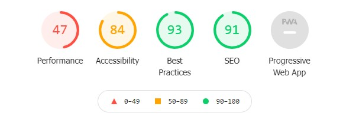
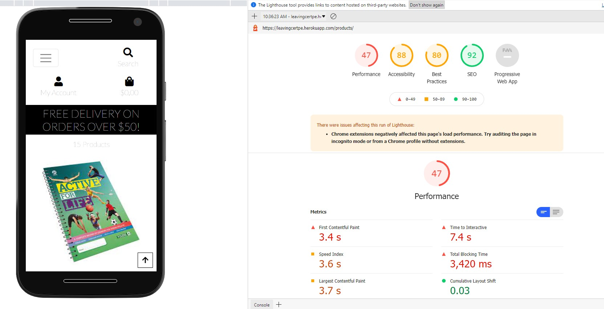
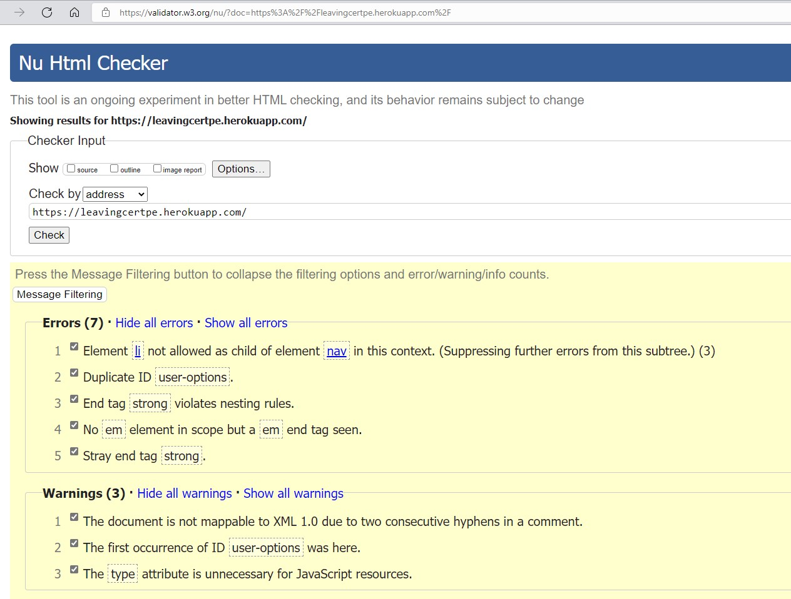
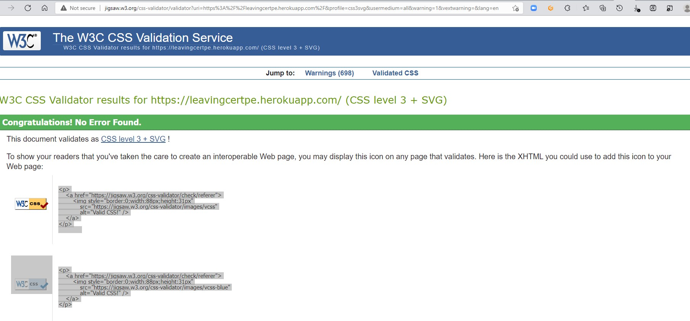

## Functionality

### Accounts & User Authentication
- [x] Registration & Login forms validation works as expected with user feedback on error
- [x] Previously existing emails will not be allowed to register again
- [x] Valid registration forms create a User model within the database
- [x] Login and logout links work as expected
- [x] Views hidden behind a `@login_required` successfully direct user to the login page with a `?next` link  to redirect users after user authentication
- [x] If user inputs invalid information in login form, or navigates to the register page to set up an account, `?next` link is retained between views to redirect user
- [x] Delete account erases users from the database and any associated ratings, reviews or addresses
- [x] Orders are maintained within the system on Account deletion, with user set to NULL:

### Landing Page

- [x] Category links on landing page lead to the correct URLs without error
- [x] When changing viewport, the background images loaded but issue with heroku background image
- [x] Hover, focus and active styles work on all links 
- [x] The main site heading and subheading are on all common viewports, maximising visual impact and contrast 

### Navigation Bar

- [x] Navigation links lead to the correct URLs without error
- [x] Navbar links change appropriately depending on whether user is logged in or not
- [x] Hover, focus and active styles work on all links 
- [x] Subcategories appear on hover on all desktop viewports
- [x] The Cart updates accurately reflecting how many items it contains
- [x] The navbar changes from horizontal to hamburger for any viewports under 1200px
- [x] The nav menu takes up the page on mobile devices, yet the hamburger menu, background image and cart remain visible 

### Shop

#### Sort, Search & Filter
- [x] The search bar validation works and will request text input if empty
- [x] Products menu works and provides accurate results searching within price, rating category.
- [x] Dropdown filter works for each option, and does not reset existing filters applied on products shown
- [x] Dropdown links have hover styled on desktop to clearly show user what item is being selected 

#### Product Cards

- [x] Image thumbnails display for all products
- [x] Product brand logo displays and fits just below main image
- [x] Product title is displayed accurately
- [x] Clicking anywhere within the above three items will link to the product featured in the particular card
- [x] Star ratings display accurately, rating out of 5 for all resources. 
- [x] Hover, focus and active styles work on all links 
- [x] Add to cart button successfully adds 1 unit of the selected product to the cart, also can update cart to add more than 1 unit

### Product Page

- [x] As in the product cards, all information is accurate to the product in the database with no missing data
- [x] Quantity select number input will be set to 0 if item is out of stock
- [x] Otherwise, quantity select has a minimum of 1 and a maximum of the total items in stock  
- [x] Product details are responsive with a layout switch at 1200px
- [x] Rating star input works as expected and confirms action with a star message

### Cart

- [x] quantity selectors on cart have a maximum value of item stock and a minmum value of 0 - which removes item from cart, as does 'Remove Item' button
- [x] If a user has previously added an item to the cart and returns later to buy it.

### Checkout

- [x] If a user has no items in their cart and navigates to `/checkout/`, user is redirected back to `/cart/` and inform user that their cart is empty
- [x] On proceeding to the checkout screen, a Stripe payment intent is created:
- [x] Make default addrss checkbox successfully changes default address in user account
- [x] On valid checkout form input, user is successfully charged and payment succeeds:
- [x] Successful checkout directs user to an order summary screen
- [x] Successful checkout creates an order in the database associated with correct user, which appears in the user's order history
- [x] Successful checkout also sends an HTML email confirmation to user:

## Testing User Stories

### New Visitors

+ to see the content and products on offer without having to register
+ to be able to add items to my cart and save them for later
	- [x] Users can see all products, reviews and ratings and add items to cart without having yet registered. Cart items will be saved in browser (once user is not in incognito mode, or clears browser sessions) for later purchase without sign up
+ to be able to easily register for the site
+ any items in my cart to remain there after I have registered for the site
	- [x] There is a focus on quick and easy registration for this site, as users are logged in as soon as they are registered.
	- [x] Validation errors that might prevent registration form from being submitted are also clear so that users can amend and submit registration form successfully
+ to quickly and easily filter and search for particular items
+ to be able to sort displayed items by price or user rating
	- [x] Filter is clear and legible on all screens and quickly navigates to category or section chosen by user.
	- [x] Sorting of items is limited to the most wanted features so that it is clear and user can quickly find what they are looking for (i.e. nobody wants to search for 'lowest rated')

### Repeat Visitors

+ to easily login to my existing account
	- [x] Login form is clear and similar to registration provides clear validation if user has not submitted form correctly
+ for my previously added cart items to remain selected
	- [ ] This user story is fulfilled provided user has not been browsing in incognito, cleared browser cache or logged out of their account (this is as `session.flush()` is called as part of Django's built in logout functionality)
+ to be able to checkout quickly using my previously saved details
	- [x] Users can not only save and edit their saved delivery details within their account page, but a cusom checkbox field is also prominent within the checkout form for users to save details for next purchase 
+ to be able to see my order history
	- [x] Order history lists all purchases made by a user in their account page
	- [x] An email receipt with full details, including delivery address for every order, is also sent to the user's email on every purchase 
+ to be able to review purchased items, and edit and delete my reviews
	- [x] User's can rate items or can rate + review items on every product page
	- [x] If user has not yet written a review then a large 'write a review' button is displayed prompting user interaction

### All users
+ to get feedback when I have completed an action on the site
	- [x] As well as form validation as listed above, many actions on the website include styled messages notifying user that their action has been successful or not. These include logging in/out, account creation/deletin, rating, reviewing, adding to cart and purchasing

+ for the cost and fees involved in an order to be transparent and not confusing in any way
	- [x] As noted in cart, delivery fees are clearly displayed before user proceeds to checkout
	- [x] A breakdown of costs is also displayed at checkout, on checkout confirmation and in confirmation email 
+ to get a record/confirmation of a successful purchase
	- [x] Order history lists all purchases made by a user in their account page
	- [x] An email receipt with full details, including delivery address for every order, is also sent to the user's email on every purchase 
+ for purchases to be completed securely
	- [x] Purchases are completed using the Stripe API, a well known ecommerce payment solution with a good reputation
	- [x] A webhook is implemented within the checkout app, so that the order is successfully processed in case the checkout process gets interrupted; for example - if the user closes the browser window early, or there is an interruption to their internet connection.

### Site Owner

+ To be able to add new stock or update existing stock easily
	- [x] Model elements such as slug, date added or thumbnail are automated and are made readonly within the admin to prevent incorrect input
	- [x] Stock levels can be easily adjusted with a simply quantity select  
+ users to be able to easily recover their account if they have lost their login details
	- [x] Password change procedure is the same for all users, whether authenticated or anonymous and is operated through the email with clear instructions at each stage

Password Reset Email           |
:-------------------------:|

+ for the website to appear clean, professional and high quality
	- [x] Professional design was a priority right from initial wireframing, and existing popular ecommerce sites such as [gov.ie](https://www.gov.ie/en/organisation/department-of-education/?referrer=http://www.education.ie/)  were used as inspiration in this regard
	- [x] During user  testing by peers and relatives, website was designed as `professional`, `clean` and `slick`.
+ for the website to work on all viewports, so customers can shop from any device
	- [x] website has been tested extensively on multiple viewports, and any responsiveness issues have been responded to and fixed
+ for the payment system to be secure and free of errors, such as orders going through without payment or payments being taken multiple times
	- [x] No issues have been raised during user testing, and as outlined above - the Stripe API and use of webhooks provides a secure and functional payment process

## Lighthouse

- I conducted Lighthouse audits on the main views (and most content filled) on the site: Home, Product Page
- Performance scores suffered somewhat on mobile
- Future improvements that could improve performance scores for all platforms would be to serve static files using compression

## Validators

### [CSS3](https://jigsaw.w3.org/css-validator/)

    

            
Valid CSS!

    

### [JSHint](https://jshint.com/)

For testing Javascript I used jshint as I progressed through the project to check on my code

## Usability
- To test the ease of navigation, this website was shared with friends and family of different ages and different levels of computer/smart device knowledge. There were no issues identified regarding the simplicity of navigating the website
- To further expand on user testing,  some 'dummy' accounts were created to test the registration, log-in, membership subscription, CRUD functionality purchasing items.

## Bugs

A major bug which was a reoccuring issue for me was Gitpod - as they changed the system without notification (tutor support advised)

It had a massive impact on my time, workspace and requirement.txt file.

I contstantly had to create a new workspace - upload requirement.txt file using file fixer and it took over alot of my time. 

Credit to James - Tutor Support who worked me throught all these issues.

